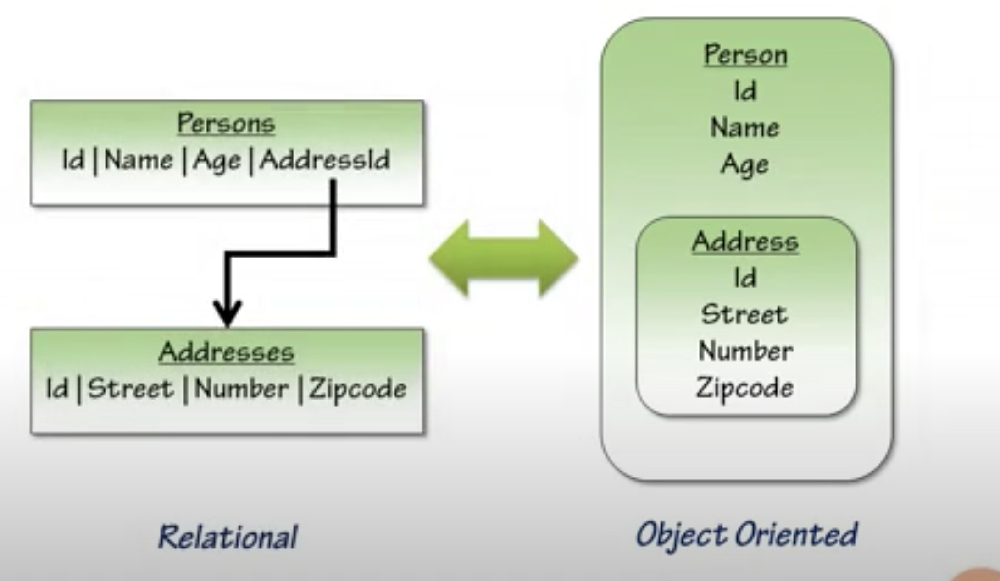

When it comes to back-end development, working wth databases can become a hassle if you're not a master at the sql being used.
There are many database systems to choose from. The list includes:

> Mysql
> PostgresSQL
> MariaDB
> MongoDB
> Oracle

and many others. However, the database system being used depends entirely on the requirements of the project which may change with time.
The senarios where the DB system changes along with time can be a very complicated one; if you need to change the entire database setup from the connection to the queries. Here is where ORM or Object-Relational-Mapping comes to the rescue. It actually makes it easier to write code once you get the hang of them. Not just this, an Object-Relational-Mapping tool entirely takes away the pain (perceived) of writing SQL. As object-oriented programmers, we tend to think in terms of objects.

Let's take an example

As we can see on the 'Relational' side, the table 'Persons' has the attributes 'Id', 'Name', 'Age' and 'AddressId'. 'Addresses' is another table with attributes 'Id', 'Street', 'Number' and 'Zipcode' which references the table 'Persons' with foreign key as 'AddressId'.

This is mapped to the 'Object' side and the table 'Persons' is considered as an object: 'Person' (Note that an ORM converts the name of the table into singular form) with the attributes as keys and the relation with the 'Addresses' table can be represented within the object itself where 'Address' itself can be a key inside the 'Person' object.

What does it give me as a developer?

> You get to write in the language you are already using anyway. Being honest, we probably aren’t the best at writing SQL statements. SQL is a ridiculously powerful language, but most of us don’t write in it often. We do, however, tend to be much more fluent in one language or another and being able to leverage that fluency is awesome!

> It abstracts away the database system so that switching from MySQL to PostgreSQL, or whatever flavor you prefer, is easy-peasy.

> Depending on the ORM you get a lot of advanced features out of the box, such as support for transactions, connection-pooling, migrations, seeds, streams, and all sorts of other goodies.

What can be a problem?

> If you are a master at SQL, you can probably get more performant queries by writing them without using ORM.

> There is overhead involved in learning how to use any given ORM.

> The initial configuration of an ORM can be a headache.

> Lastly, as a developer, it is important to understand what is happening under the hood. Since ORMs can serve as a crutch to avoid understanding the databases and the SQL, it can make you a weaker developer in that portion of the stack.

Some Popular ORMs for Node.js:
TypeORM and Sequelize are the two most popular relational database ORMs.

We'll be talking about Sequelize here.
Sequelize is a promise-based ORM for Node.js v4 and up. It supports the dialects PostgreSQL, MySQL, SQLite and MSSQL and features solid transaction support, relations, read replication and more
Getting started:

Lets start! Let’s npm init before installing our packages!

npm init

Npm install sequelize with PostgreSQL

npm install sequelize
npm install pg pg-hstore

we’ll use the Sequelize CLI (Command Line Interface) to create a Postgres database and generate models, migrations, and seed files using our terminal in MacOS or Linux.

npm install --save-dev sequelize-cli

Next we will initialize a Sequelize project, then open the directory in our code editor:

npx sequelize-cli init
code .

Initializing the project creates four subdirectories: config, migrations, models, and seeders. First, we’ll look in config to set up our project to work with Postgres.

For future projects, you’ll use config/config.json to control user access, name databases, and determine which SQL dialect Sequelize will use. For now, you can cut and paste, replacing what is currently in the file with the code below.
sequelize-project/config/config.json:
{
"development": {
"database": "sequelize_project_development",
"host": "127.0.0.1",
"dialect": "postgres"
},
"test": {
"database": "sequelize_project_test",
"host": "127.0.0.1",
"dialect": "postgres"
},
"production": {
"database": "sequelize_project_production",
"host": "127.0.0.1",
"dialect": "postgres"
}
}
